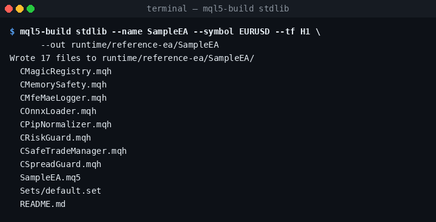
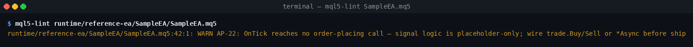
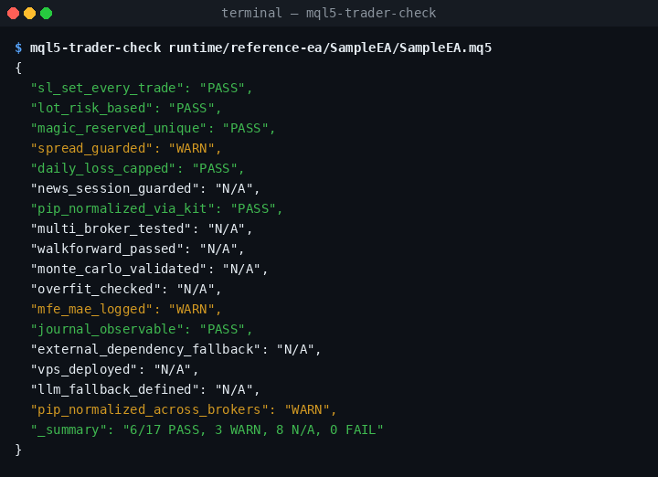
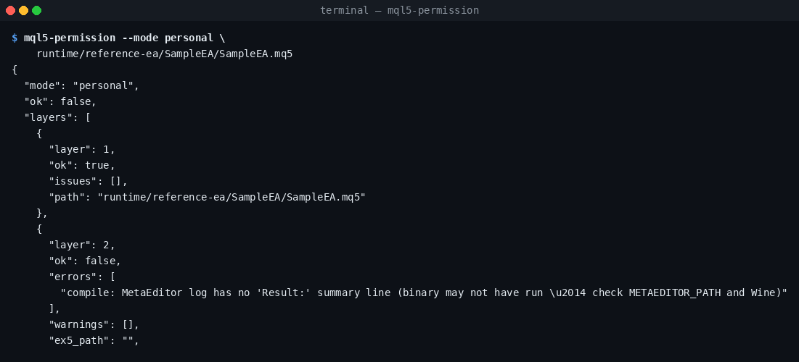

# Quickstart — 15 phút

> **Tuyên bố trung thực.** `Trader-17`, ma trận chất lượng `8×8`, các
> mã lỗi `AP-1…AP-25`, pipeline phân quyền 7 lớp, và bộ persona RRI
> đều là **các heuristic do dự án này tự định nghĩa**. Đây là các
> guardrail có chủ kiến — **không phải chuẩn ngành**, không phải
> chứng chỉ, và **không thay thế** việc kiểm thử trên tài khoản thật.

15 phút từ lúc clone repo đến scaffold EA đầu tiên đã pass lint, và các
gate của kit sẽ nói rõ phần nào ready/chưa ready để ship. Không yêu cầu
kinh nghiệm MQL5 trước đó. Wine và MetaEditor là **tuỳ chọn** ở bước
1–4; chỉ cần ở bước 5 khi bạn muốn biên dịch thật ra file `.ex5`.

Phiên bản tiếng Anh: [`docs/QUICKSTART.md`](QUICKSTART.md).

---

## 1. Cài đặt (≈ 3 phút)

```bash
git clone https://github.com/VibeMql5Codekit/vibecodekit-mql5-ea-25.5
cd vibecodekit-mql5-ea-25.5
python -m venv .venv && source .venv/bin/activate
pip install -e ".[dev]"
```

Xác nhận kit import sạch. Cờ `--soft` đẩy các probe môi trường về
WARN thay vì FAIL, hữu ích trên máy không có Wine:

```bash
python -m vibecodekit_mql5.doctor --soft
```

---

## 2. Scaffold EA đầu tiên (≈ 1 phút)

```bash
mql5-build stdlib \
    --name SampleEA \
    --symbol EURUSD --tf H1 \
    --out runtime/reference-ea/SampleEA
```

`stdlib` là preset an toàn nhất để bắt đầu — netting, một symbol, một
entry mỗi bar. Xem `mql5-build --list` (hoặc thư mục `scaffolds/`) cho
toàn bộ ma trận preset/stack.



File `SampleEA.mq5` được sinh ra đã include sẵn `CPipNormalizer`,
`CRiskGuard`, `CMagicRegistry`, `CSpreadGuard`, và `CSafeTradeManager`
— phần pip math cross-broker + cap rủi ro + đăng ký magic number mà
các gate của kit kỳ vọng.

---

## 3. Lint (≈ 30 giây)

```bash
mql5-lint runtime/reference-ea/SampleEA/SampleEA.mq5
```



Scaffold tươi báo `0 ERROR, 1 WARN` — WARN là `AP-22`
("signal logic là placeholder"). Đây là kit nhắc bạn rằng scaffold chưa
có call đặt lệnh nào: đó là khung sườn, chưa phải chiến lược. 25 anti-pattern
detector được tài liệu hoá ở
[`AGENTS.md` § Rule ID → documentation table](../AGENTS.md#rule-id--documentation-table)
và `docs/anti-patterns-AVOID.md`.

---

## 4. Trader-17 readiness check (≈ 30 giây)

```bash
mql5-trader-check runtime/reference-ea/SampleEA/SampleEA.mq5
```



Trader-17 là checklist 17 mục pre-deployment do kit này tự định nghĩa
(xem [`docs/references/59-trader-checklist.md`](references/59-trader-checklist.md)).
Gate yêu cầu **≥ 15 / 17 PASS**; scaffold tươi báo 6 PASS, 3 WARN,
8 N/A — nhiều mục (walk-forward, Monte-Carlo, multi-broker, overfit,
VPS, news-session) cần **bằng chứng bên ngoài** mới score được.
Scaffold tươi đương nhiên không pass nổi, và đó là gate **hoạt động
đúng**.

---

## 5. Pipeline phân quyền 7 lớp (≈ 1 phút)

Pipeline 7 lớp là một gate do dự án định nghĩa, chạy source-lint →
compile → AP-lint → Trader-17 → methodology → quality-matrix →
broker-safety. Gate này **fail-fast** — lớp đầu tiên fail sẽ dừng các
lớp sau.

```bash
mql5-permission --mode personal \
    runtime/reference-ea/SampleEA/SampleEA.mq5
```



Trên máy Linux không có Wine, lớp 2 (compile) fail-fast vì không có
MetaEditor để invoke. Đó là đúng: gate **không** lặng lẽ skip compile.
Để pass được lớp 2, cài Wine + MetaEditor:

```bash
./scripts/setup-wine-metaeditor.sh   # ~3 phút, chỉ Linux
```

Khi lớp 2 xanh, lớp 4 (Trader-17) sẽ là chốt gate tiếp theo trên
scaffold tươi — cho đến khi bạn wire signal thật vào, các check
Trader-17 vẫn dưới ngưỡng 15/17. Iterate bằng cách edit block signal
trong `SampleEA.mq5` rồi chạy lại pipeline.

---

## 6. Iterate (phần thực sự tạo ra giá trị)

Vòng lặp build → lint → trader-check → permission là phần bạn cycle
trong lúc viết chiến lược. Bản one-shot cho cả pipeline:

```bash
mql5-auto-build --spec ea-spec.yaml --out-dir build/MyEA
```

…chain scan → build → lint → compile → permission → dashboard và viết
một file `auto-build-report.json` idempotent duy nhất.

Để sinh `ea-spec.yaml` từ free-text:

```bash
mql5-spec-from-prompt "EA trend EURUSD H1, risk 0.5% mỗi lệnh" \
    --out ea-spec.yaml
```

---

## Đi tiếp ở đâu

- [`README.md`](../README.md) — feature inventory + bản đồ năng lực.
- [`AGENTS.md`](../AGENTS.md) — contract chính cho AI coding agent
  (bảng rule_id → docs, schema JSON envelope, reference numbers).
- [`docs/COMMANDS.md`](COMMANDS.md) — toàn bộ CLI command group theo
  lifecycle.
- [`docs/USER-GUIDE-vi.md`](USER-GUIDE-vi.md) — walkthrough chi tiết.
- [`docs/reference-ea/REPORT.md`](reference-ea/REPORT.md) — số đo thật
  từ gates trên một scaffold tươi.
- [`docs/anti-patterns-AVOID.md`](anti-patterns-AVOID.md) — các
  anti-pattern kit này từ chối ship.
- [`docs/devin-chat-driven-build.md`](devin-chat-driven-build.md) —
  flow chat → spec → auto-build → PR cho Devin.

Mọi số liệu trong hướng dẫn này đều reproducible — bạn có thể regen
bất cứ lúc nào:

```bash
bash scripts/tools/build_reference_report.sh
python  scripts/tools/render_quickstart_screenshots.py
```
